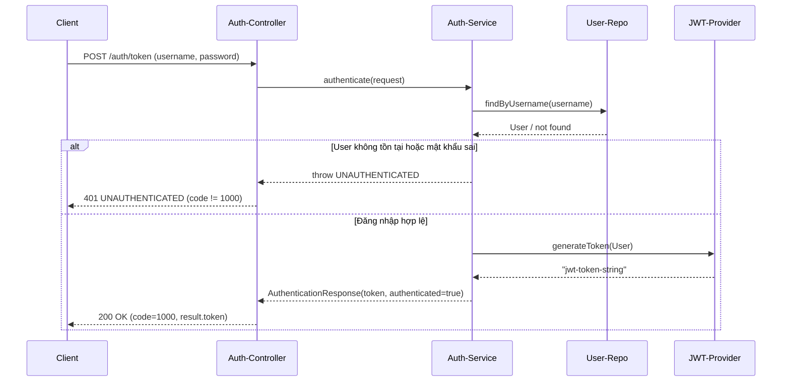
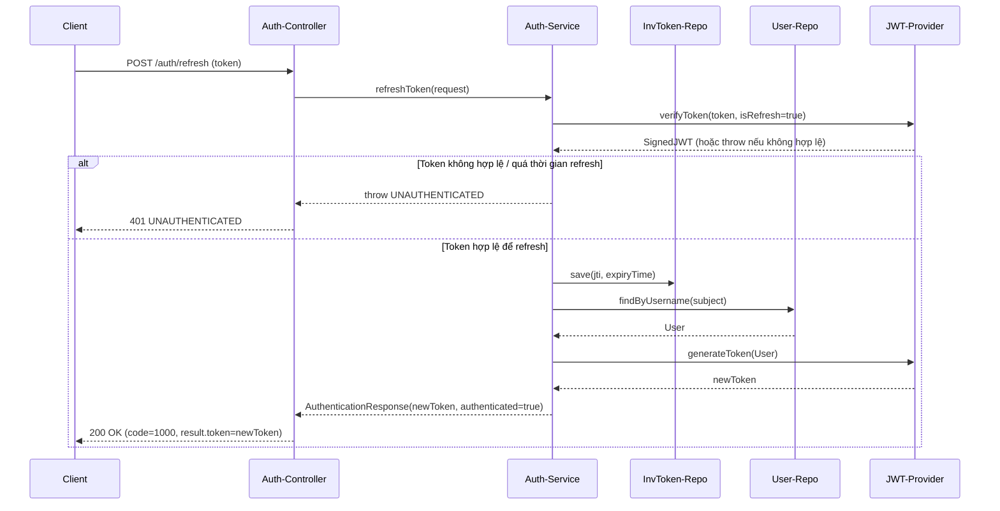
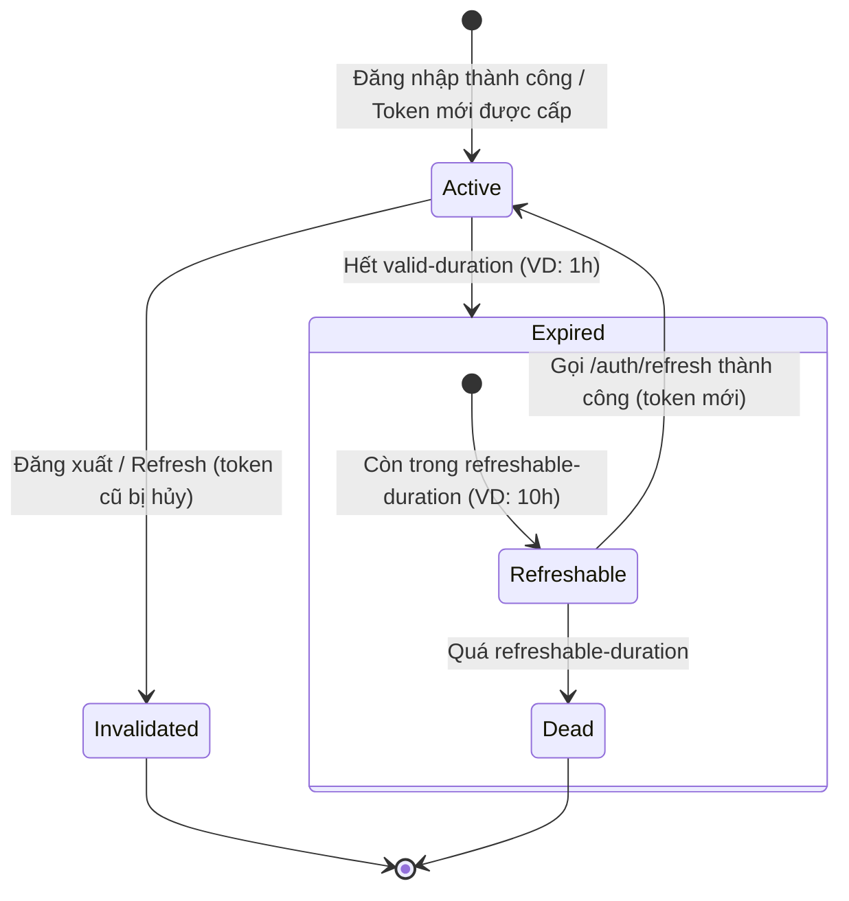

## 1. Giới thiệu tổng quan Auth-Service

**Auth-Service** (hay Identity Service) là microservice chịu trách nhiệm:

- **Xác thực (Authentication)**: Đăng nhập, cấp JWT token.
- **Ủy quyền (Authorization)**: Gắn quyền truy cập (roles/permissions) cho người dùng.
- **Quản lý tài khoản**: Tạo, sửa, xóa, xem thông tin người dùng.
- **Bảo mật phiên làm việc**: Đăng xuất, vô hiệu hóa token, cơ chế gia hạn token (refresh).

Service này được các service khác (learning-service, finance-service, gamification-service, …) tin cậy thông qua JWT token, thường đi qua API Gateway.

---

## 2. Công nghệ sử dụng

- **Ngôn ngữ**: Java 17+
- **Framework**:
  - Spring Boot (REST API, cấu hình)
  - Spring Security (bảo mật, xác thực/ủy quyền)
  - Spring Data JPA + Hibernate (ORM, truy cập DB)
- **Bảo mật**:
  - OAuth2 Resource Server (Bearer Token)
  - JWT (JSON Web Token, thuật toán HS512)
  - BCrypt (mã hóa mật khẩu)
- **Cơ sở dữ liệu**: MySQL
- **Build & quản lý phụ thuộc**: Maven
- **Khác**:
  - Lombok (giảm boilerplate code)
  - Jakarta Persistence API

---

## 3. Luồng hoạt động chính

### 3.1. Đăng nhập & sử dụng JWT

1. Người dùng gọi `POST /auth/token` với `username` và `password`.
2. Auth-Service kiểm tra:
   - Username tồn tại hay không.
   - Password có khớp (BCrypt) hay không.
3. Nếu hợp lệ:
   - Sinh JWT chứa:
     - `sub` (subject) = username
     - `userId`
     - `scope` (roles & permissions)
     - `iat` (issue time)
     - `exp` (expiration time, ví dụ 1 giờ)
   - Trả JWT cho client.
4. Các request sau đó từ frontend/backend khác sẽ gửi kèm:
   - Header: `Authorization: Bearer <jwt-token>`.

### 3.2. Xác thực token ở các service khác

1. API Gateway hoặc service đích nhận request.
2. Token được decode, kiểm tra:
   - Chữ ký (HS512 + `jwt.signerKey`) có hợp lệ không.
   - Token còn hạn (`exp`) không.
   - Token có nằm trong bảng `InvalidatedToken` (đã logout / bị hủy) không.
3. Nếu hợp lệ:
   - Gắn thông tin user (roles/permissions) vào `SecurityContext`.
   - Cho phép truy cập API tương ứng.

### 3.3. Gia hạn token (Refresh Token “ngầm”)

Auth-Service cấu hình:

- `jwt.valid-duration`: thời gian token **có thể sử dụng** (ví dụ: 1 giờ).
- `jwt.refreshable-duration`: thời gian token **có thể dùng để xin cấp mới** (ví dụ: 10 giờ).

Luồng:

1. Token hết hạn sử dụng (quá `valid-duration`) nhưng chưa quá `refreshable-duration`.
2. Client gọi `POST /auth/refresh` với token cũ.
3. Auth-Service:
   - Kiểm tra token cũ còn trong “thời gian có thể refresh”.
   - Nếu hợp lệ:
     - Ghi `jwtId` của token cũ vào bảng `InvalidatedToken` (không cho dùng lại).
     - Sinh token mới với `jwtId` mới, `exp` mới.
4. Client cập nhật token mới và tiếp tục sử dụng mà không cần đăng nhập lại.

### 3.4. Đăng xuất (Logout)

1. Client gọi `POST /auth/logout` với token hiện tại.
2. Auth-Service:
   - Verify token (ở chế độ `isRefresh = true` để cho phép token sắp hết hạn).
   - Lấy `jwtId` và `expiryTime` của token.
   - Lưu `jwtId` + `expiryTime` vào bảng `InvalidatedToken`.
3. Từ thời điểm đó, token này bị xem là không hợp lệ kể cả khi chưa hết hạn.

---

## 4. Các nhóm API & tính năng

### 4.1. Nhóm Auth (Authentication)

- **POST `/auth/token`**
  - Chức năng: Đăng nhập, cấp JWT.
  - Request: `{ "username": "...", "password": "..." }`
  - Response: `{ code: 1000, result: { token, authenticated: true } }`

- **POST `/auth/introspect`**
  - Chức năng: Kiểm tra token hợp lệ hay không.
  - Request: `{ "token": "<jwt-token>" }`
  - Response: `{ code: 1000, result: { valid: true/false } }`

- **POST `/auth/logout`**
  - Chức năng: Đăng xuất, đưa token vào blacklist (`InvalidatedToken`).
  - Request: `{ "token": "<jwt-token>" }`

- **POST `/auth/refresh`**
  - Chức năng: Gia hạn token (cấp token mới dựa trên token cũ).
  - Request: `{ "token": "<expired-or-soon-expired-jwt>" }`
  - Response: `{ code: 1000, result: { token, authenticated: true } }`

### 4.2. Nhóm Quản lý mật khẩu

- **POST `/auth/forgot-password`**
  - Chức năng: Gửi OTP qua email để reset mật khẩu.
  - Request: `{ "email": "..." }`

- **POST `/auth/verify-otp`**
  - Chức năng: Xác thực OTP.
  - Request: `{ "email": "...", "otp": "..." }`
  - Response: `{ code: 1000, result: true/false }`

- **POST `/auth/reset-password`**
  - Chức năng: Đặt lại mật khẩu mới sau khi OTP hợp lệ.
  - Request: `{ "email": "...", "otp": "...", "newPassword": "..." }`

### 4.3. Nhóm User (User Management)

- **POST `/users`**
  - Tạo user mới (đăng ký).

- **GET `/users/my-info`**
  - Lấy thông tin user đang đăng nhập (dựa trên token).

- **GET `/users`**
  - Lấy danh sách tất cả user (dành cho ADMIN).

- **GET `/users/{userId}`**
  - Lấy thông tin chi tiết của 1 user.

- **PUT `/users/{userId}`**
  - Cập nhật thông tin user (họ tên, email, phone, roles, ...).

- **DELETE `/users/{userId}`**
  - Xóa 1 user.

### 4.4. Nhóm Role & Permission (nếu có controller riêng)

- CRUD Role: tạo/sửa/xóa/xem roles.
- CRUD Permission: tạo/sửa/xóa/xem permissions.

---

## 5. Cấu trúc Database (ERD)

Các bảng chính:

- **User**
  - `id` (UUID, PK)
  - `username` (unique)
  - `password`
  - `firstName`
  - `lastName`
  - `dob`
  - `email`
  - `phone`
  - Quan hệ: N–N với `Role`

- **Role**
  - `id` (PK hoặc tên là PK tùy code)
  - `name` (ví dụ: `LEARNER`, `CREATOR`, `ADMIN`)
  - `description`
  - Quan hệ: N–N với `User`, N–N với `Permission`

- **Permission**
  - `id`
  - `name` (ví dụ: `CREATE_COURSE`, `DELETE_USER`, …)
  - `description`

- **InvalidatedToken**
  - `id` (JWT ID – JTI)
  - `expiryTime` (thời điểm token hết hạn thực sự)

### Quan hệ chính

- `User` **N – N** `Role` (qua bảng trung gian `user_roles`)
- `Role` **N – N** `Permission` (qua bảng trung gian `role_permissions`)

---

## 6. UML – Use Case Diagram (tổng quan chức năng)

```mermaid
usecaseDiagram
actor "User" as User
actor "Admin" as Admin

rectangle "Auth-Service" {
  usecase "Đăng nhập" as UC_Login
  usecase "Đăng ký" as UC_Register
  usecase "Đăng xuất" as UC_Logout
  usecase "Gia hạn Token" as UC_Refresh
  usecase "Lấy lại mật khẩu (OTP)" as UC_ForgotPass
  usecase "Xem thông tin cá nhân" as UC_ViewProfile
  usecase "Cập nhật thông tin cá nhân" as UC_UpdateProfile
  usecase "Quản lý User" as UC_ManageUser
}

User --> UC_Login
User --> UC_Register
User --> UC_Logout
User --> UC_Refresh
User --> UC_ForgotPass
User --> UC_ViewProfile
User --> UC_UpdateProfile

Admin --> UC_Login
Admin --> UC_Logout
Admin --> UC_ManageUser
Admin --> UC_ViewProfile
```

---

## 7. UML – Class Diagram (mô hình lớp chính)

```mermaid
classDiagram
class User {
  String id
  String username
  String password
  String firstName
  String lastName
  LocalDate dob
  String email
  String phone
  Set~Role~ roles
}

class Role {
  String id
  String name
  String description
  Set~Permission~ permissions
}

class Permission {
  String id
  String name
  String description
}

class InvalidatedToken {
  String id
  Date expiryTime
}

class AuthenticationService {
  +authenticate(request)
  +refreshToken(request)
  +logout(request)
  +introspect(request)
}

class AuthenticationController {
  +POST /auth/token
  +POST /auth/introspect
  +POST /auth/refresh
  +POST /auth/logout
}

class UserController {
  +POST /users
  +GET /users
  +GET /users/{id}
  +GET /users/my-info
  +PUT /users/{id}
  +DELETE /users/{id}
}

User "1" -- "*" Role : has
Role "1" -- "*" Permission : has
AuthenticationService ..> User : uses
AuthenticationService ..> InvalidatedToken : manages
AuthenticationController ..> AuthenticationService : calls
UserController ..> User : manages
```

---

## 8. UML – Sequence Diagram

### 8.1. Đăng nhập (Login Flow)



### 8.2. Gia hạn Token (Refresh Flow)



---

## 9. UML – Activity Diagram (xử lý request có JWT)

```mermaid
activityDiagram
  start
  :Client gửi request kèm Authorization: Bearer <token>;
  :Filter / Gateway nhận request;

  if (Có token?) then (Không)
    :Trả về 401 Unauthorized;
    stop
  endif

  :Decode & Verify chữ ký token;
  if (Chữ ký hợp lệ?) then (Không)
    :Trả về 401 Unauthorized;
    stop
  endif

  :Kiểm tra hạn dùng (exp);
  if (Token hết hạn?) then (Có)
    :Trả về 401 Unauthorized;
    stop
  endif

  :Kiểm tra token trong bảng InvalidatedToken;
  if (Có trong blacklist?) then (Có)
    :Trả về 401 Unauthorized;
    stop
  endif

  :Trích xuất userId, roles, permissions;
  :Gắn SecurityContext;
  :Chuyển tiếp request đến Controller đích;
  stop
```

---

## 10. UML – State Diagram (vòng đời JWT Token)



---

## 11. Kết luận

Tài liệu này mô tả:

- Vai trò của Auth-Service trong kiến trúc tổng thể.
- Công nghệ và mô hình bảo mật sử dụng JWT.
- Các nhóm API chính và chức năng tương ứng.
- Cấu trúc database và quan hệ giữa các thực thể.
- Các luồng & trạng thái chính thông qua sơ đồ UML (Use Case, Class, Sequence, Activity, State).

Bạn có thể dùng file này làm tài liệu thiết kế/kỹ thuật hoặc đính kèm trong báo cáo đồ án.


