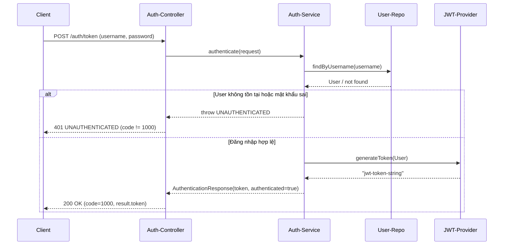
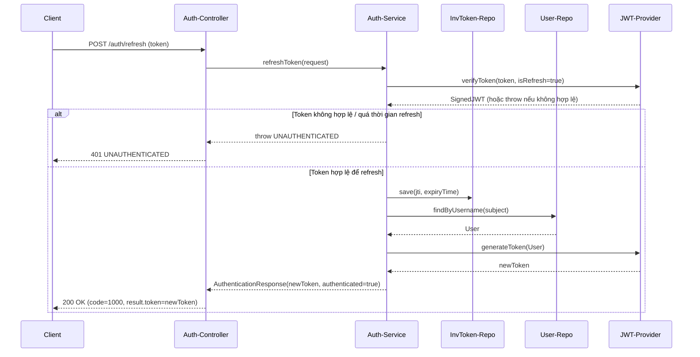
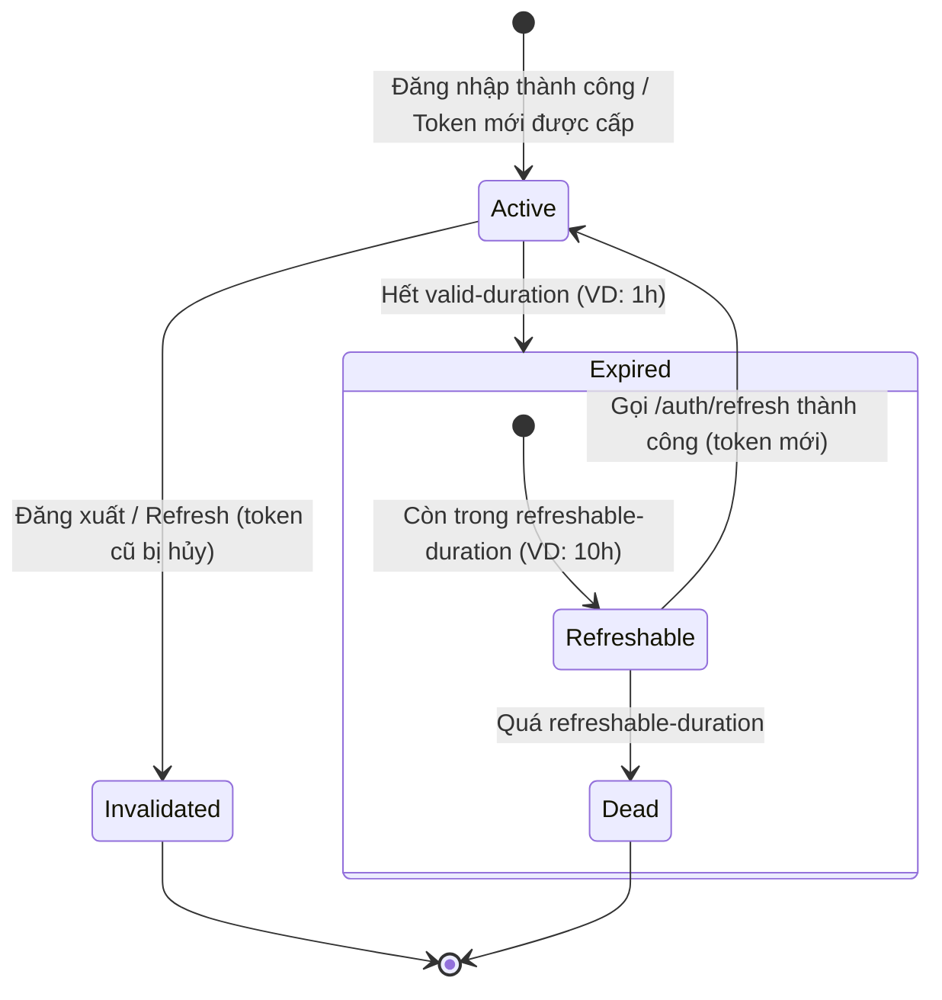

## 1. User Requirement (Đặc tả yêu cầu người dùng)

### 1.1. Giới thiệu hệ thống EduFinAI

EduFinAI là hệ thống học tập trực tuyến kết hợp giáo dục và tài chính, hỗ trợ người dùng:

- Học các khoá học (video, bài tập, quiz…).
- Quản lý ví, giao dịch tài chính liên quan đến khoá học.
- Tích điểm, gamification để tăng mức độ gắn kết.

Trong kiến trúc tổng thể microservices của EduFinAI, **Auth-Service** (Identity Service) là service trung tâm chịu trách nhiệm:

- Xác thực người dùng (Authentication) thông qua JWT.
- Gắn quyền và vai trò (Authorization) cho từng user.
- Quản lý tài khoản, reset mật khẩu, quản lý vòng đời token.

### 1.2. Đối tượng sử dụng hệ thống

- Người học (Learner): đăng ký, đăng nhập, tham gia khoá học, xem và cập nhật thông tin cá nhân.
- Người tạo nội dung (Creator): tương tự Learner, thêm quyền tạo/chỉnh sửa nội dung, khoá học.
- Quản trị viên (Admin): quản lý người dùng, phân quyền, giám sát hoạt động hệ thống.

### 1.3. Nhu cầu và mục tiêu của người dùng

- Đăng ký / Đăng nhập / Đăng xuất một cách nhanh chóng, an toàn.
- Duy trì phiên đăng nhập ổn định, hạn chế bị đăng xuất giữa chừng (cơ chế refresh token).
- Quên mật khẩu, lấy lại mật khẩu qua email và OTP.
- Xem và chỉnh sửa thông tin cá nhân (họ tên, email, số điện thoại…).
- Quản trị người dùng (dành cho Admin): tạo/sửa/xóa user, gán/thu hồi role, permission.

### 1.4. Use Case tổng quan

Các Use Case chính của Auth-Service:

- Login, Register, Logout.
- Refresh Token.
- Forgot Password (OTP), Reset Password.
- View Profile (My Info), Update Profile.
- Manage Users (Admin).

Use Case Diagram (mermaid – có thể chuyển sang PlantUML nếu cần):

```mermaid
usecaseDiagram
actor "User" as User
actor "Admin" as Admin

rectangle "Auth-Service" {
  usecase "Đăng nhập" as UC_Login
  usecase "Đăng ký" as UC_Register
  usecase "Đăng xuất" as UC_Logout
  usecase "Gia hạn Token" as UC_Refresh
  usecase "Lấy lại mật khẩu (OTP)" as UC_ForgotPass
  usecase "Xem thông tin cá nhân" as UC_ViewProfile
  usecase "Cập nhật thông tin cá nhân" as UC_UpdateProfile
  usecase "Quản lý User" as UC_ManageUser
}

User --> UC_Login
User --> UC_Register
User --> UC_Logout
User --> UC_Refresh
User --> UC_ForgotPass
User --> UC_ViewProfile
User --> UC_UpdateProfile

Admin --> UC_Login
Admin --> UC_Logout
Admin --> UC_ManageUser
Admin --> UC_ViewProfile
```

---

## 2. Software Requirement Specification (SRS)

### 2.1. Phạm vi của Auth-Service

- Mục tiêu:
  - Cung cấp cơ chế xác thực/ủy quyền tập trung cho toàn bộ hệ thống EduFinAI.
  - Cấp, kiểm tra, gia hạn và vô hiệu hoá JWT.
  - Quản lý thông tin tài khoản người dùng và phân quyền.
- Các hệ thống tương tác:
  - API Gateway: nhận request từ client, forward đến Auth-Service hoặc các service khác.
  - Các business service: `learning-service`, `finance-service`, `gamification-service`, …
  - Email Server: gửi OTP và email reset mật khẩu.
  - Database MySQL: lưu thông tin user, roles, permissions, invalidated tokens.

### 2.2. Yêu cầu chức năng (Functional Requirements)

- FR-01 – Đăng nhập
  - Người dùng cung cấp `username/password`.
  - Hệ thống kiểm tra thông tin và trả về JWT nếu hợp lệ.
- FR-02 – Đăng ký tài khoản
  - Hệ thống cho phép tạo tài khoản mới với các thông tin cơ bản.
- FR-03 – Đăng xuất
  - Khi user logout, token hiện tại bị đưa vào danh sách blacklist (InvalidatedToken).
- FR-04 – Gia hạn token (Refresh)
  - Hệ thống cho phép cấp mới JWT dựa trên token cũ còn trong khoảng thời gian `refreshable-duration`.
- FR-05 – Quên mật khẩu & OTP
  - Gửi OTP qua email, verify OTP, cho phép đặt lại mật khẩu mới.
- FR-06 – Quản lý người dùng
  - CRUD User (tạo, xem, sửa, xóa), phân quyền (gán Role/Permission).
- FR-07 – Quản lý vai trò & quyền
  - CRUD Role, CRUD Permission (tuỳ kiến trúc controller).
- FR-08 – Introspect token
  - Kiểm tra token có hợp lệ, còn hạn, không bị vô hiệu hay không.

### 2.3. Yêu cầu phi chức năng (Non-Functional Requirements)

- Bảo mật:
  - Mật khẩu được hash bằng BCrypt.
  - JWT được ký bằng thuật toán HS512 với `signerKey` bí mật.
  - Giao tiếp chỉ qua HTTPS trong môi trường production.
- Hiệu năng & mở rộng:
  - Xử lý được số lượng request đăng nhập/refresh lớn.
  - Dễ dàng scale-out theo chiều ngang (stateless authentication với JWT).
- Khả năng sẵn sàng & tích hợp:
  - Hoạt động liên tục, phục vụ cho nhiều service khác.
  - Tích hợp qua API Gateway theo chuẩn REST.
- Logging & giám sát:
  - Ghi log các sự kiện bảo mật quan trọng (login fail, logout, reset password…).
  - Có khả năng tích hợp với các hệ thống giám sát (Prometheus, ELK…).

### 2.4. Các ràng buộc và giả định

- Công nghệ: Java 17+, Spring Boot, Spring Security, Spring Data JPA, MySQL.
- Kiến trúc: microservices, API Gateway, JWT-based auth.
- Giả định:
  - Người dùng có email hợp lệ để nhận OTP.
  - API Gateway đã cấu hình route đúng đến Auth-Service.
  - Service chạy trong môi trường có cấu hình mail server, DB ổn định.

---

## 3. Architecture Design (Thiết kế kiến trúc)

### 3.1. Kiến trúc tổng thể hệ thống

- Client (Frontend): Web/App gọi API qua Gateway, gửi kèm JWT trong header.
- API Gateway: entry point, định tuyến request đến Auth-Service hoặc các service khác.
- Auth-Service:
  - Cấp JWT cho user.
  - Xử lý đăng nhập, đăng xuất, refresh, forgot password.
- Các service nghiệp vụ khác: chỉ tin tưởng JWT được Auth-Service cấp.
- Database & Email server:
  - MySQL lưu trữ user/role/permission/token.
  - Mail server gửi OTP, email reset password.

### 3.2. Các thành phần chính trong Auth-Service

- Controller layer:
  - `AuthenticationController`: `/auth/token`, `/auth/introspect`, `/auth/refresh`, `/auth/logout`, forgot/reset password.
  - `UserController`: `/users`, `/users/my-info`, CRUD user.
- Service layer:
  - `AuthenticationService`: xử lý logic đăng nhập, refresh, logout, introspect.
  - `OtpService`: sinh và verify OTP.
  - `EmailService`: gửi email OTP, reset password.
- Repository layer:
  - `UserRepository`, `RoleRepository`, `PermissionRepository`, `InvalidatedTokenRepository`.
- Security & Config:
  - `SecurityConfig`: cấu hình Spring Security, public/protected endpoints, resource server.
  - `CustomJwtDecoder`: verify, parse JWT để tích hợp với Spring Security.
  - `JwtAuthenticationEntryPoint`: xử lý lỗi unauthorized.

### 3.3. Sơ đồ kiến trúc (mô tả)

- Client → API Gateway → Auth-Service → MySQL.
- Các service khác (learning, finance, …) cũng đi qua Gateway, dùng chung JWT để kiểm tra quyền.
- Auth-Service là stateless, không lưu session server-side, mọi trạng thái phiên được mã hoá trong JWT + blacklist token.

---

## 4. Detail Design (Thiết kế chi tiết)

### 4.1. Thiết kế cơ sở dữ liệu (ERD – logic)

**Bảng `User`**:

- `id` (UUID, PK)
- `username` (unique)
- `password`
- `firstName`, `lastName`
- `dob` (ngày sinh)
- `email`
- `phone`
- Quan hệ: N–N với `Role` qua bảng `user_roles`.

**Bảng `Role`**:

- `id`
- `name` (VD: `LEARNER`, `CREATOR`, `ADMIN`)
- `description`
- Quan hệ: N–N với `User`, N–N với `Permission` qua bảng `role_permissions`.

**Bảng `Permission`**:

- `id`
- `name` (VD: `CREATE_COURSE`, `DELETE_USER`, …)
- `description`

**Bảng `InvalidatedToken`**:

- `id` (JWT ID – JTI)
- `expiryTime` (thời điểm token hết hạn thực sự, phục vụ cleanup)

**Quan hệ chính**:

- `User` N–N `Role`.
- `Role` N–N `Permission`.

### 4.2. Class Diagram (mô hình lớp)

```mermaid
classDiagram
class User {
  String id
  String username
  String password
  String firstName
  String lastName
  LocalDate dob
  String email
  String phone
  Set~Role~ roles
}

class Role {
  String id
  String name
  String description
  Set~Permission~ permissions
}

class Permission {
  String id
  String name
  String description
}

class InvalidatedToken {
  String id
  Date expiryTime
}

class AuthenticationService {
  +authenticate(request)
  +refreshToken(request)
  +logout(request)
  +introspect(request)
}

class AuthenticationController {
  +POST /auth/token
  +POST /auth/introspect
  +POST /auth/refresh
  +POST /auth/logout
}

class UserController {
  +POST /users
  +GET /users
  +GET /users/{id}
  +GET /users/my-info
  +PUT /users/{id}
  +DELETE /users/{id}
}

User "1" -- "*" Role : has
Role "1" -- "*" Permission : has
AuthenticationService ..> User : uses
AuthenticationService ..> InvalidatedToken : manages
AuthenticationController ..> AuthenticationService : calls
UserController ..> User : manages
```

### 4.3. Sequence Diagram (luồng nghiệp vụ chính)

#### 4.3.1. Đăng nhập (Login Flow)



#### 4.3.2. Gia hạn Token (Refresh Flow)



### 4.4. Activity Diagram (xử lý request có JWT)

```mermaid
activityDiagram
  start
  :Client gửi request kèm Authorization: Bearer <token>;
  :Filter / Gateway nhận request;

  if (Có token?) then (Không)
    :Trả về 401 Unauthorized;
    stop
  endif

  :Decode & Verify chữ ký token;
  if (Chữ ký hợp lệ?) then (Không)
    :Trả về 401 Unauthorized;
    stop
  endif

  :Kiểm tra hạn dùng (exp);
  if (Token hết hạn?) then (Có)
    :Trả về 401 Unauthorized;
    stop
  endif

  :Kiểm tra token trong bảng InvalidatedToken;
  if (Có trong blacklist?) then (Có)
    :Trả về 401 Unauthorized;
    stop
  endif

  :Trích xuất userId, roles, permissions;
  :Gắn SecurityContext;
  :Chuyển tiếp request đến Controller đích;
  stop
```

### 4.5. State Diagram (vòng đời JWT Token)



---

## 5. System Implementation (Mã nguồn)

### 5.1. Công nghệ và thư viện sử dụng

- Ngôn ngữ: Java 17+
- Framework:
  - Spring Boot, Spring Web.
  - Spring Security, OAuth2 Resource Server.
  - Spring Data JPA + Hibernate.
- Bảo mật:
  - JWT (Nimbus JOSE + JWT), HS512.
  - BCryptPasswordEncoder.
- CSDL: MySQL.
- Khác: Lombok, Maven, Jakarta Persistence.

### 5.2. Cấu trúc thư mục mã nguồn Auth-Service (mô tả)

- `controller/` – chứa các REST controller (`AuthenticationController`, `UserController`, …).
- `service/` – chứa business logic (`AuthenticationService`, `OtpService`, `EmailService`, …).
- `entity/` – chứa các entity ánh xạ DB (`User`, `Role`, `Permission`, `InvalidatedToken`).
- `repository/` – interface JPA repository.
- `configuration/` – cấu hình bảo mật, JWT, mail, … (`SecurityConfig`, `CustomJwtDecoder`).
- `dto/` – các request/response DTO.
- `exception/` – định nghĩa exception, handler.

### 5.3. Mô tả chi tiết một số thành phần chính

- `AuthenticationService`:
  - `authenticate()`: xử lý đăng nhập, kiểm tra username/password, sinh JWT.
  - `refreshToken()`: verify token cũ, ghi vào `InvalidatedToken`, sinh token mới.
  - `logout()`: đưa token hiện tại vào blacklist.
  - `introspect()`: kiểm tra token hợp lệ hay không.
  - `forgotPassword()`, `resetPassword()`: luồng OTP – đặt lại mật khẩu.
- `SecurityConfig` & `CustomJwtDecoder`:
  - Cấu hình resource server, xác định các endpoint public/protected.
  - Cấu hình decoder JWT, kết nối với `jwt.signerKey`.
- `UserController`:
  - Expose các API CRUD user, `GET /users/my-info` dựa theo token.

---

## 6. Testing Document (Tài liệu kiểm thử)

### 6.1. Chiến lược kiểm thử

- Unit Test:
  - Kiểm thử các service quan trọng: `AuthenticationService`, `OtpService`, `EmailService`, các validator.
- Integration Test:
  - Gọi trực tiếp các endpoint `/auth/token`, `/auth/refresh`, `/auth/logout`, `/users/my-info` trên môi trường test DB.
- Security Test:
  - Thử gọi API:
    - Không có token.
    - Token sai chữ ký.
    - Token hết hạn.
    - Token đã logout (nằm trong `InvalidatedToken`).

### 6.2. Danh sách Test Case chính (gợi ý)

- TC-01: Đăng nhập thành công với username/password đúng.
- TC-02: Đăng nhập sai mật khẩu → trả lỗi UNAUTHENTICATED.
- TC-03: Gọi API protected không gửi token → 401 Unauthorized.
- TC-04: Refresh token trong thời gian cho phép → nhận token mới hợp lệ.
- TC-05: Refresh token quá `refreshable-duration` → 401 UNAUTHENTICATED.
- TC-06: Logout, sau đó dùng lại token cũ → 401 Unauthorized.
- TC-07: Gửi email forgot password với email hợp lệ → OTP được tạo.
- TC-08: Verify OTP sai → bị từ chối reset password.
- TC-09: Reset password thành công, đăng nhập lại với mật khẩu mới.

### 6.3. Kết quả kiểm thử

- Lập bảng gồm: Mã Test Case, Mô tả, Input, Expected Output, Actual Result, Status (Pass/Fail), Ghi chú.
- Tổng hợp:
  - Số lượng test case đã chạy.
  - Số lượng Pass/Fail.
  - Các lỗi còn tồn tại và hướng khắc phục.

---

## 7. Installation Guide (Hướng dẫn cài đặt & triển khai)

### 7.1. Yêu cầu môi trường

- Phần mềm:
  - JDK 17+.
  - Maven 3+.
  - MySQL (hoặc compatible).
- Cấu hình hệ thống:
  - Biến môi trường (nếu có): `DB_URL`, `DB_USERNAME`, `DB_PASSWORD`, `JWT_SIGNER_KEY`, `MAIL_HOST`, `MAIL_USERNAME`, `MAIL_PASSWORD`, …

### 7.2. Cấu hình database & file `application.yaml`

- Kết nối DB:
  - `spring.datasource.url`
  - `spring.datasource.username`
  - `spring.datasource.password`
- Cấu hình JWT:
  - `jwt.signerKey`
  - `jwt.valid-duration`
  - `jwt.refreshable-duration`
- Cấu hình mail server:
  - `spring.mail.host`, `spring.mail.port`
  - `spring.mail.username`, `spring.mail.password`
  - `spring.mail.properties.*` (TLS/SSL nếu cần)

### 7.3. Các bước build & chạy Auth-Service

1. Clone project từ repository.
2. Cấu hình `application.yaml` / `application.properties` cho phù hợp môi trường.
3. Chạy lệnh:
   - `mvn clean package` để build.
   - `mvn spring-boot:run` hoặc `java -jar target/auth-service-*.jar`.
4. Kiểm tra service lên thành công bằng cách gọi `GET /actuator/health` (nếu bật).

### 7.4. Tích hợp với API Gateway & các service khác

- Trên API Gateway:
  - Khai báo route: `/auth/**` → Auth-Service.
  - Các route khác (learning, finance, …) yêu cầu header `Authorization: Bearer <token>`.
- Frontend:
  - Sau khi đăng nhập thành công, lưu token (localStorage/cookie an toàn).
  - Gửi token kèm header `Authorization` trong mọi request cần bảo mật.

### 7.5. Hướng dẫn sử dụng cơ bản

1. Đăng ký (nếu có API riêng) hoặc tạo user bằng Admin.
2. Đăng nhập qua `POST /auth/token` để nhận JWT.
3. Dùng JWT để gọi các API: thêm header `Authorization: Bearer <token>`.
4. Khi token gần hết hạn:
   - Gọi `POST /auth/refresh` để lấy token mới.
5. Khi người dùng muốn đăng xuất:
   - Gọi `POST /auth/logout` với token hiện tại.

---

## 8. Phụ lục

- Có thể tách riêng toàn bộ các sơ đồ mermaid ở trên vào một file `auth-service-diagrams.puml`/`.md` để dễ quản lý.
- Khi cần nộp file Word, có thể copy nội dung file này và chuyển các sơ đồ sang hình ảnh UML tương ứng.


